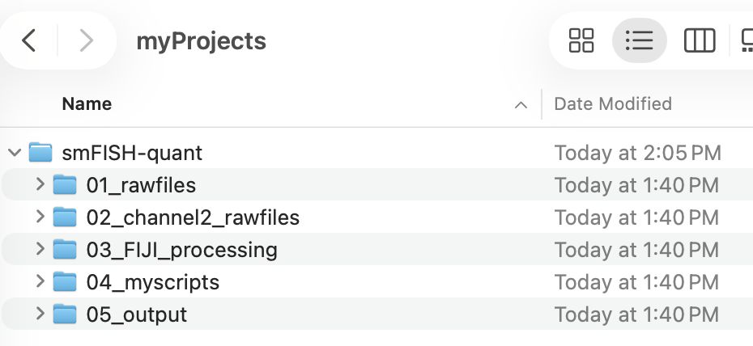

# Starting a computational project

Welcome! Let's start a computational project to analyze smFISH data. 

## Create a project directory

Here, you will create a directory/folder on your local computer where we can do this work.

   -  Create a new **directory** in a location on your local computer where you conduct projects. Name it `smFISH-quantify` where you will do today's exercise.
   - Navigate inside `smFISH-quantify` and create the following new **sub-directories**:
     - `01_rawfiles`
     - `02_channel2_rawfiles`
     - `03_FIJI_processing`
     - `04_myscripts`
     - `05_output`

   = If you did this correctly, your file structure should look like this:

