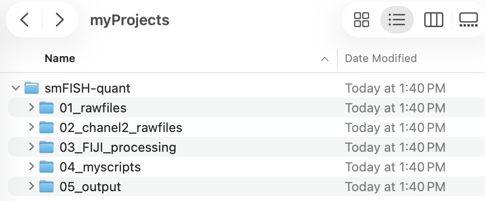

# Starting a computational project

Welcome! Let's start a computational project to analyze smFISH data. 

Here, you will create a directory/folder on your local computer where we can do this work.

:arrow_right: Where you see an arrow - perform these actions.

:arrow_right: Create a new directory called `smFISH-quantify` where you will do today's exercise.

:arrow_right: Navigate inside `smFISH-quantify` and create the following new **sub-directories**:

  - `01_rawfiles`
  - `02_channel2_rawfiles`
  - `03_FIJI_processing`
  - `04_myscripts`
  - `05_output`

If you did this correctly, your file structure should look like this:

